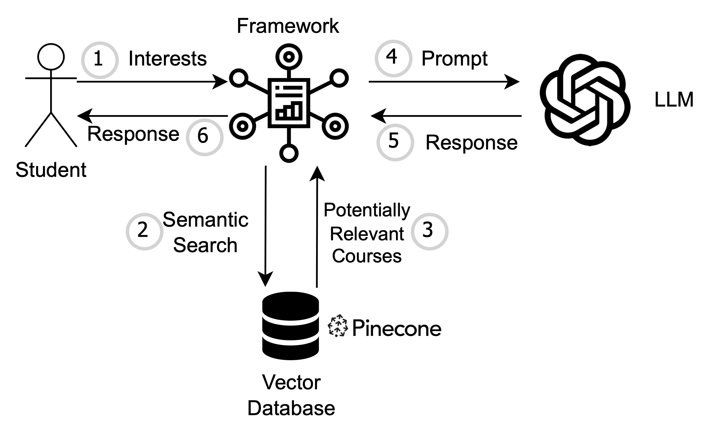

# Princeton Courses Chatbot
-
## Information
This project uses the Retrieval Augmented Generation (RAG) framework in conjunction with the OpenAI GPT API to create a chatbot, Greg, that can make class suggestions to students based on their interests and preferences.

This project is set up right now just to work on my machine due to the API keys involved, which I have stored locally. In the future I may set up a server to process user queries. With that being said, the project in its current state still serves as an instructional example for RAG.

The workflow for the chatbot is shown below. First, the user enters their interests/what they want (e.g., "I want to take a seminar class next semester with a focus on religion"). We use the OpenAI GPT API to then generate a *hypothetical* course description based off the student's interests. Then, we vectorize this description and perform a semantic search returning the top *k*=15 courses and their descriptions. This is used as context in the next GPT API request, which returns the actual response that is displayed to the user. 

<!--## Setting Up
If you do want to set up this project on your own end, 

`git clone git@github.com:awiteck/courses-chatbot.git`

`cd courses-chatbot/`

`python -m venv courses-chatbot`

`source courses-chatbot/bin/activate`

`pip install -r requirements.txt`

`python main.py`-->